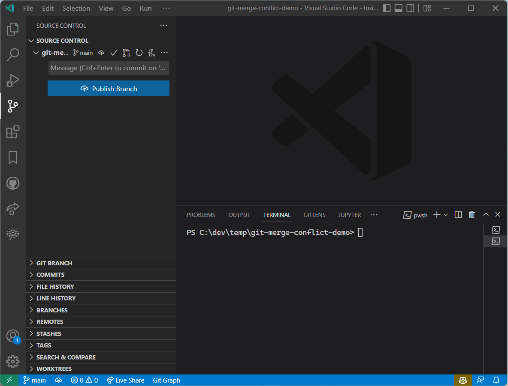

# Git Branch Workshop

สำหรับ workshop นี้จะเป็นการสอนการใช้งานฟีเจอร์ branch และ merge ของ Git

## Learning Outcomes
- รู้จักและเข้าใจการ control source code version ด้วยการสร้าง branch
- ความแตกต่างระหว่าง main/master branch กับ branch อื่น ๆ
- เข้าใจจุดประสงค์การ merge
- สามารถแก้ไขปัญหา merge conflicts
- (optional)
  - git branches best practice
  - การเปิด pull request / merge request

## Introduction to Git Branches and Merge
Git เป็น version control system ที่ช่วยในการติดตามการเปลี่ยนแปลง (changes) ของโค้ดเรา ซึ่งมีหนึ่งฟีเจอร์ที่สำคัญที่สุดที่ Git เลยก็คือ ความสามารถในการที่สามารถสร้าง branch และจัดการโค้ดของเราผ่าน branch ต่าง ๆ


Branch ใน Git นั้นคือ เส้น commit line ที่แยกออกมาจาก main branch ที่สามารถทำให้ developer ทุกคนสามารถแก้ไขโค้ดของตนเองโดยที่**ไม่กระทบต่อ main branch**.

> ในการทำงานระดับอุตสาหกรรม main branch ถือเป็นโค้ดที่จะถูก deploy ในระดับ production 
> 
> ดังนั้นจะมีการ protect branch ให้ไม่สามารถแก้ไขใด ๆ ได้ทั้งสิ้น 
> จะสามารถแก้ไขได้โดยการเปิด pull request / merge request เท่านั้น

ซึ่งมีประโยชน์มากเมื่อเราต้องพัฒนาฟีเจอร์ใหม่, แก้ bug, ทดสอบแก้ไขโค้ดโดยที่งานเราไม่ส่งผลกระทบต่อ source code หลักของทีม

ซึ่งหลังจากเราแก้ไขโค้ดที่เป็นของเราเสร็จแล้ว เราก็สามารถ merge โค้ดของเราให้กลับไปที่ main branch ได้ และด้วยความสามารถเหล่านี้จะทำให้การทำ branching และ merging ถือเป็นฟีเจอร์ทรงอานุภาพที่สุดของ Git ที่จะทำให้ developers ทุกคนสามารถทำงานบนโปรเจคเดียวกันได้อย่างราบรื่น

## Creating, Switching and Deleting Branches

การสร้าง branch ใหม่สามารถทำได้ผ่านคำสั่ง
```
git branch [branch_name]
```
และสลับไปที่ branch ดังกล่าวได้ด้วยคำสั่ง
```
git checkout [branch_name]
```
> สามารถย่อคำสั่งการสร้างและการสลับ branch ไว้ในคำสั่งเดียวได้
> `
> git checkout -b [branch_name]
> `
> โดย git จะสร้าง branch ใหม่ให้แล้วสลับไป branch นั้นโดยอัตโนมัติ


การลบ branch สามารถทำได้ผ่านคำสั่ง
```
git branch -d [branch_name]
```

<!-- ให้นักศึกษาลองสร้าง branch ใหม่และ commit ที่ branch ใหม่ดู และลองสลับกลับไป branch เก่าดู จะเห็นว่าใน main branch ไม่มี commit ของเรา แต่ใน branch ใหม่จะมี -->

## Start doing some examples

1. ให้สร้าง branch ใหม่ตามคำสั่ง command line ด้านบน
1. แก้ไขโค้ดในไฟล์ `index.html` ตรงไหนก็ได้ และเพิ่มไฟล์ `cat.txt` ที่มีคำว่า cat ลงไป
1. ใช้คำสั่ง `git add ./` เพื่อ add ไฟล์ทั้งหมดใน working directory นี้ไปยัง staged area 
1. `git commit -m "try to edit some texts"`
1. `git log --oneline` เพื่อเช็คว่าใน branch ใหม่ของเรานี้มี commit message ใหม่ขึ้นมารึยัง
1. จากนั้นให้ลองใช้คำสั่ง `git checkout main` เพื่อกลับมาที่ branch main เพื่อดูความแตกต่างจะเห็นว่าไฟล์ `cat.txt` หายไป และไฟล์ `index.html` ก็กลับมาเป็นเวอร์ชั่นที่ยังไม่ถูกแก้ไข
2. `git log --oneline` อีกครั้งใน branch main นี้จะเห็นว่าไม่มี commit message อันใหม่ที่เราเคยสร้าง

## Merging Branches
การ merging branches ใน Git นั้นเป็นการที่เราสามารถ**รวม**โค้ดจาก branch หนึ่งไปยังอีก branch หนึ่ง

### ขั้นตอนการ merge :
- ให้สลับไปที่ `[target branch]` (main branch หรือ branch หลักที่ต้องการให้รวมเข้าไป)
- ใช้คำสั่ง `git merge [source_branch]`

### ตัวอย่างเช่น 

หากต้องการ merge branch ที่มีชื่อว่า `feature/new-update` ให้เข้าไปที่ main branch

ใช้คำสั่งสลับ branch เพื่อให้ไปที่ `main` branch ที่เราจะ merge เข้า
```
git checkout main
```
> main คือชื่อ branch

จากนั้นใช้คำสั่ง merge เพื่อรวม branch `feature/new-update` เข้าไปใน branch `main`
```
git merge feature/new-update
```

ในการ merge นั้นจะเป็นหน้าที่ของ Git ที่จะใช้เทคนิคเฉพาะตัวในการหาจุดที่สามารถ merge ได้เอง โดยถ้าแก้ไขของเราไม่ได้ซับซ้อนมาก Git จะสามารถ merge changes ของเราได้ด้วยตัวเองเลย

> เทคนิคและอัลกอริทึ่มการ merge ของ git ในเชิงลึกสามารถอ่านต่อได้ใน
> - [How does 'git merge' work in details?](https://stackoverflow.com/questions/14961255/how-does-git-merge-work-in-details)
> - [git/trivial-merge.txt](https://github.com/git/git/blob/master/Documentation/technical/trivial-merge.txt)

ในกรณีที่หาก Git ไม่สามารถ merge การแก้ไขของเราได้ด้วยตนเอง จะเกิดสิ่งที่เรียกว่า **Merge Conflicts** และเป็นหน้าที่ของ Developer ที่จะต้องแก้ไขข้อผิดพลาดเหล่านั้นด้วยตนเอง

เมื่อขจัด conflicts ทั้งหมดและ merge เสร็จเรียบร้อยแล้ว ถ้าหากไม่มีการใช้งาน source branch สามารถลบ branch ที่ถูกแยกออกมาได้เลยทันที

## Resolving Merge Conflicts

Merge Conflict จะเกิดขึ้นก็ต่อเมื่อ 2 branches ที่ต้องการ merge นั้นมีการแก้ไขที่จุดเดียวกัน และ Git ไม่สามารถตัดสินใจได้ว่าผู้พัฒนาต้องการใช้ source code จากจุดไหนกันแน่ ดังนั้น Git จึงเลือกที่จะให้ผู้พัฒนาเป็นคนแก้ไข conflict นั้นด้วยตนเองแทน


### ขั้นตอนการแก้ไข merge conflict :
1. หาไฟล์ที่เกิด merge conflict ซึ่งรายชื่อไฟล์ที่เกิดปัญหาทั้งหมดจะถูกแสดงผ่าน terminal อยู่แล้วเมื่อเราทำการ merge
2. จะพบหน้าตาของไฟล์ในลักษณะดังนี้


3. ให้ทำการลบส่วนที่เราไม่ต้องการออกไป อย่างเช่น ตัวอย่างในรูปภาพด้านบน เราต้องการเก็บ white เอาไว้ ก็ให้ลบบรรทัดดังกล่าวตาม snippet ด้านล่างออกไป
	```
	<<<<<<< HEAD
	green
	=======
	>>>>>>>
	```
4. ให้ทำการรันคำสั่ง `git add [file_name]` และ `git commit` เพื่อเป็นการเซฟไฟล์ที่แก้ไข merge conflict เรียบร้อยแล้ว
5. หลังจาก commit เสร็จเรียบร้อย จะถือว่า merge เสร็จเรียบร้อยแล้ว

ในขั้นตอนการแก้ไข merge conflicts นั้นจะใช้เวลาค่อนข้างนานมาก ยิ่งเมื่อ feature ของเรามีขนาดใหญ่ และ commit line ห่างจาก branch main ค่อนข้างมาก ดังนั้นทางที่ดีควรจะแบ่งฟีเจอร์ออกเป็นฟีเจอร์ย่อย ๆ และควร merge บ่อย ๆ เพื่อหลีกเลี่ยง merge conflict

> ในบางกรณี Auto Merge ของ Git นั้นก็อาจจะมีการ merge ผิดพลาดเองได้ ทางที่ดีควรตรวจสอบโค้ดที่ถูก merge ทุกครั้งก่อนที่จะ push ขึ้น remote repository

> ในการ resolve merge conflict นั้น ในปัจจุบันมีเครื่องมือและตัวช่วยในการ inspect และ resolve conflict ที่เกิดขึ้นได้ง่ายขึ้นมาก เช่น
>
> VS code extension : [GitLens](https://marketplace.visualstudio.com/items?itemName=eamodio.gitlens)
> 
> <details>
> <summary>ตัวอย่าง</summary>
>
> 
> </details>

## Git Branch And Merge Best Practices

Best practices เพื่อช่วยให้สามารถทำงานกับ branch ได้อย่างมีประสิทธิภาพ ทำให้สามารถจัดการโค้ดให้เป็นระเบียบ ทันสมัย และบำรุงรักษาได้ง่ายขึ้น โดยทั่วไปมีดังนี้

1. ตั้งชื่อ branch ให้สื่อความหมายกับสิ่งที่เราต้องการทำ โดยส่วนมากในระดับอุตสาหกรรมจะมี convention ใช้กันในทีมอย่างเช่น
   - เมื่อสร้าง branch ใหม่ควรตั้งด้วย `ชื่อผู้เขียน/ชื่อฟีเจอร์`
   - เช่น `poom/banner-rebranding`

2. ควร merge branches เป็นประจำเพื่อป้องกันการเกิด merge conflict ที่มีขนาดใหญ่ จะทำให้แก้ยากขึ้น

3. ลบ branch ที่ไม่ได้ใช้ เพื่อให้ repository มีการจัดเรียงที่สวยงามและค้นหา branch ที่เราทำงานจริง ๆ ได้ง่ายขึ้น

4. ใช้ branch แยกกันเมื่อต้องการสร้างฟีเจอร์ใหม่ รวมถึงฟีเจอร์ย่อย ๆ จะช่วยให้สามารถติดตาม changes ได้ง่ายขึ้น

5. ทำ document สำหรับ branch นั้น ๆ เอาไว้เพื่อให้ผู้พัฒนาคนอื่นเข้าใจได้ง่ายว่า branch นี้มีไว้เพื่ออะไร 
   - โดยส่วนมากจะถูกเขียนอยู่ใน pull request / merge request
